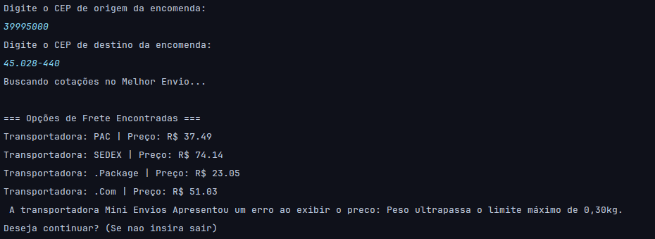
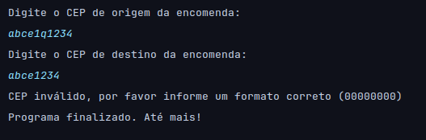
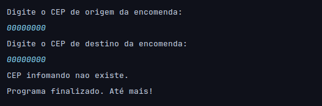

# 📦 Consultor de Frete API

Aplicação Java de linha de comando que consulta o endereço de um CEP e calcula opções de frete em tempo real, integrando duas APIs públicas: **ViaCEP** e **Melhor Envio**.

Projeto desenvolvido como prática aplicada durante os estudos da trilha de Desenvolvimento Backend Java (Alura), evoluindo o desafio original do curso "Consumindo API, gravando arquivos e lidando com erros" para uma aplicação real com escopo próprio.

## 🖼️ Demonstração

**Consulta com sucesso:**



**Tratamento de CEP em formato inválido:**



**Tratamento de CEP não encontrado:**



## ⚙️ Como funciona

1. O usuário informa o CEP de origem e destino da encomenda
2. A aplicação consulta o **ViaCEP** para validar e enriquecer os dados de endereço
3. Os CEPs são enviados para a **API do Melhor Envio**, que retorna as opções de frete disponíveis (transportadora, preço e prazo)
4. O resultado é exibido no console, incluindo o tratamento de casos em que uma transportadora não consegue calcular o frete (ex: peso acima do limite suportado)

## 🛠️ Tecnologias e conceitos aplicados

- **Java 17+** com `HttpClient` nativo (`java.net.http`) para consumo de APIs REST
- **Gson** para serialização/deserialização de JSON, incluindo listas (`TypeToken`) e mapeamento de campos com nomenclatura diferente (`@SerializedName`)
- **Tratamento de exceções**, incluindo uma exceção customizada (`CepInvalidoException extends RuntimeException`) para validação de entrada do usuário
- **Leitura de arquivo de configuração** (`config.properties`) para gerenciar credenciais sem expor no código-fonte
- **Organização em pacotes por responsabilidade**: `api` (modelos de dados/DTOs, separados por origem: `viacep` e `melhorenvio`), `consulta` (serviços que integram com as APIs), `principal` (ponto de entrada), `exceptions` (exceções customizadas)

## 📁 Estrutura do projeto

```
src/
├── principal/
│   └── Main.java
├── consulta/
│   ├── ViaCepService.java
│   ├── FreteService.java
│   └── ConfigService.java
├── api/
│   ├── viacep/
│   │   └── Endereco.java
│   └── melhorenvio/
│       ├── CepFrete.java
│       ├── Pacote.java
│       ├── CotacaoRequest.java
│       ├── CotacaoResposta.java
│       └── Transportadora.java
└── exceptions/
    └── CepInvalidoException.java
```

## 🚀 Como rodar o projeto

### Pré-requisitos

- JDK 17 ou superior
- Biblioteca Gson
- Uma conta no [ambiente sandbox do Melhor Envio](https://sandbox.melhorenvio.com.br) com um token de acesso pessoal (permissão `shipping-calculate`)

### Configuração

1. Clone o repositório
2. Renomeie (ou copie) `config.properties.example` para `config.properties`
3. Preencha com seu token:

```properties
melhorenvio.token=SEU_TOKEN_AQUI
melhorenvio.baseurl=https://sandbox.melhorenvio.com.br
```

> ⚠️ O arquivo `config.properties` está no `.gitignore` e não deve ser commitado — ele contém uma credencial pessoal.

### Executando

Rode a classe `Main` pela sua IDE, ou via terminal:

```bash
javac -d out $(find src -name "*.java")
java -cp "out:caminho/para/gson.jar" principal.Main
```

Siga as instruções no console para informar CEP de origem e destino.

## 🐛 Tratamento de erros implementado

| Cenário | Comportamento |
|---|---|
| CEP com menos de 8 caracteres | Lança `CepInvalidoException` com mensagem orientando o formato correto |
| CEP com formato correto, mas inexistente | ViaCEP retorna `{"erro": true}`; a aplicação detecta e lança `CepInvalidoException` |
| Transportadora não consegue calcular o frete (ex: peso excedido) | A API do Melhor Envio retorna um campo `error` em vez de `price`; a aplicação exibe o motivo ao usuário em vez de um valor nulo |
| Falha de conexão | `IOException` / `InterruptedException` capturadas no ponto de entrada da aplicação |

## ⚠️ Observações sobre o ambiente

Este projeto usa o **ambiente sandbox** do Melhor Envio (dados de teste, sem envios reais). Por isso:
- Nomes de algumas transportadoras podem vir incompletos ou incomuns nas respostas (ex: `.Package`, `.Com`) — comportamento observado nos dados de teste da própria API, não um bug da aplicação
- Valores e prazos não refletem tarifas reais

## 🔭 Próximos passos

- [ ] Verificar o `status code` da resposta HTTP antes de tentar deserializar (hoje a aplicação assume sucesso)
- [ ] Adicionar testes automatizados (JUnit) para os serviços e o tratamento de erros
- [ ] Migrar a leitura de configuração para variáveis de ambiente, como alternativa ao arquivo `.properties`
- [ ] Construir uma interface web simples para consumir os mesmos serviços
- [ ] Persistir o histórico de cotações realizadas em arquivo ou banco de dados

## 📚 Contexto de aprendizado

Este projeto foi construído como parte da trilha de Desenvolvimento Backend Java da Alura, aplicando na prática os conceitos de: consumo de API REST, serialização/deserialização JSON, tratamento de exceções e boas práticas de organização de código — adaptando o desafio proposto no curso para um caso de uso próprio (consulta de frete via Melhor Envio, já que a API dos Correios não está mais disponível para acesso público sem contrato comercial).

## 📄 Licença

Este projeto está sob a licença especificada no arquivo [LICENSE](LICENSE).